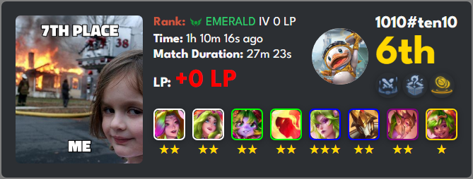

# 🌟 TFT Match Summary Bot 🌟

[](https://opensource.org/licenses/MIT)
[](https://www.python.org/)
[](https://discordpy.readthedocs.io/)

## 🚀 About the Project
This bot tracks **Teamfight Tactics (TFT)** match summaries and creates visually engaging banners for each match. It fetches player data from Riot Games, generates HTML summaries, and captures them as stylish images to post directly on Discord! 

> **Cool feature:** Automated periodic updates for your favorite players’ latest TFT match summaries, with meme images based on placement for a fun touch!

---

## 🌈 Features
- **Ranked Summaries**: Pulls ranked info with rank-specific icons and colors.
- **Placement Memes**: Adds a fun twist with meme images that match your placement!
- **Real-Time Updates**: Automatically updates every minute for a list of specified players.
- **Interactive Commands**: Get the latest match summary instantly by calling the bot.
- **Augment Icons**: Showcases augments with icons for additional style.
- **Detailed Champion List**: Displays the champions, their star levels, and price categories.

---

## 🖼️ Preview
Check out how awesome these match summary banners look!  
Here's a sample for **Emerald IV, 6th Place**:



---

## 🛠️ Installation

1. **Clone this repository**:
    ```bash
    git clone https://github.com/Rabbytez/tft_noti_discord_bot.git
    cd tft_noti_discord_bot
    ```

2. **Install Dependencies**:
    ```bash
    pip install -r requirements.txt
    ```

3. **Set Up Config**:
    - Add your Discord `TOKEN` , `CHAT_ROOM_ID` and `RIOT_IDS` to `.env` file.
    - Use your own `.env` file to store your Discord API key.

4. **Run the Bot**:
    ```bash
    python bot.py
    ```

---

## 🕹️ Commands

- **`!tft <Riot ID> <Tag>`**  
  Fetches the latest TFT match summary for the specified Riot ID and Tag.

---

## ⚙️ How It Works

1. **Data Fetching**: Pulls data from the MetaTFT API based on Riot ID.
2. **HTML Template Rendering**: Jinja2 generates a dynamic HTML template based on player stats and match details.
3. **Screenshot Capture**: Uses Selenium to capture the template as an image.
4. **Discord Posting**: The bot sends the image to Discord, tagging the user.

### Key Modules

- **`main.py`**: Core logic for fetching TFT data and processing match summaries.
- **`augments.py`**: Fetches augment icons for each match.
- **`bot.py`**: Discord bot setup with commands and automated updates.

---

## 📷 Sample Banner Breakdown

| **Component**         | **Description**                                              |
|-----------------------|--------------------------------------------------------------|
| **Meme Image**        | Adds humor based on placement (e.g., "Disaster Girl" meme).  |
| **Rank & LP Change**  | Displays current rank, LP change in green/red based on gain/loss. |
| **Champion List**     | Shows champions used with icons, stars, and price indicators. |
| **Augment Icons**     | Includes augments selected with unique icons for flair.      |

---

## 🛡️ License
This project is licensed under the MIT License. See the [LICENSE](LICENSE) file for details.

---

## 💡 Contributing
Contributions are what make the open-source community amazing! If you have suggestions, fork the repo and create a pull request.

1. Fork the Project
2. Create your Feature Branch (`git checkout -b feature/AmazingFeature`)
3. Commit your Changes (`git commit -m 'Add some AmazingFeature'`)
4. Push to the Branch (`git push origin feature/AmazingFeature`)
5. Open a Pull Request

---

## ⭐ Acknowledgements

- [MetaTFT API](https://www.metatft.com/) - For providing TFT data.
- [Discord.py](https://discordpy.readthedocs.io/) - For making Discord bot integration seamless.

---

**Made with 💖 by Rabbytez dev**  
**README.md generated by ChatGPT**  
**Stay tuned for more cool features and updates!**
